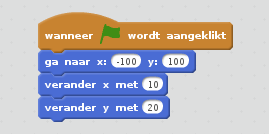
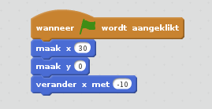
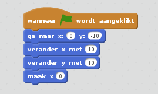

**Oefening:** Wat is de positie van de sterren?

------ | ------
ster A | (4,6)
ster B | (1,0)
ster C | (1,3)

**Oefening:** Beweeg met de muis naar de volgende plekken. Wat is de positie van:

------------------------- | ------------
1. de linkerbovenhoek     |  (-240,180)
2. de rechterbovenhoek    |  (240,180)
3. het midden             |  (0,0)
4. de linkerbenedenhoek   |  (-240,-180)
5. de rechterbenedenhoek  |  (240,-180)

**Oefening:** wat betekent het als de y-positie negatief is? En als de y-positie positief is?

Als de y-positie negatief is, betekent dit dat we onder het midden zitten. Als de y-positie positief is, zitten we boven het midden.

**Oefening:** bij hoeveel blauwe blokjes heb je te maken met een x- of een y-positie?

8: "ga naar x: (0) y: (0)", "schuif in (1) sec. naar x: (0) y: (0)", "verander x met (10)", "maak x (0)", "verander y met (10)", "maak y (0)", "x-positie" en "y-positie".

**Oefening:** Ik heb drie scripts gemaakt. Wat is de positie van mijn sprite als het script klaar is, bij script A,B en C? Je mag het proberen uit je hoofd te bedenken, maar je kan ook het script nabouwen en uitvoeren.

-------- | ---------------------- | ------------
script A |  | (-90,120)
script B |  | (20,0)
script C |  | (0,0)

**Oefening:** Wat is het verschil tussen "maak x 20" en "verander x met 20"?

"maak x 20" zet de sprite op x-positie 20 (de y-positie blijft hetzelfde).
"verander x met 20" *verplaatst* de sprite 20 posities naar rechts.

**Oefening:** Wat doet "verander x met -10" ?

Veranderen met een negatief getal verplaatst de sprite naar links. In dit geval verplaats je de sprite 10 plaatsen naar links.

**Oefening:** Hoe verplaats je de sprite 15 posities naar beneden?

Naar beneden verplaatsen doe je ook met een negatief getal. Dus "verander y met -15" verplaatst de sprite 15 posities omlaag.

