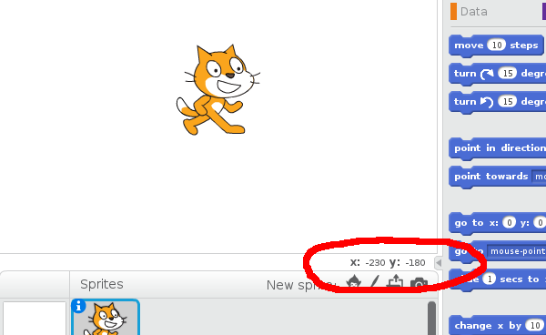

# Het scherm en posities

We gaan leren hoe je sprites op het Scratch scherm zet en hoe je ze kan verplaatsen.

## Waar ben ik?

Het scherm in Scratch is eigenlijk een soort ruitjespapier, waarop je de sprites (zoals bijvoorbeeld de kat) kunt neerzetten en kunt laten bewegen. Op iedere plek waar twee lijntjes elkaar kruisen, kun je een sprite zetten.

De horizontale lijnen hebben nummers en de verticale ook. Als we dus willen zeggen waar op het ruitjespapier we zijn, moeten we kijken naar het nummer van de lijntjes. Deze nummers noemen we de x-positie en de y-positie. Een moeilijk woord hiervoor is coordinaat, maar dat mag je meteen weer vergeten.

De x-positie geeft aan waar je *horizontaal* bent, de y-positie geeft aan waar je *verticaal* bent. In de tekening hierboven is van ster A de x-positie 4 en de y-positie 6. Meestal zeggen we dan dat de positie van A gelijk is aan (4,6) en we spreken het uit als vier komma zes en we schrijven het tussen haakjes met een komma tussen de x- en y-positie.

**Oefening:** Wat is de positie van de sterren?

| ------ | ------
| ster A | (4,6)
| ster B |
| ster C |

## Het Scratch scherm

Als je met de muis over het Scratch scherm beweegt, zie je rechtsbeneden de x- en de y-positie van de muisaanwijzer.

**Oefening:** Beweeg met de muis naar de volgende plekken. Wat is de positie van:

| ------------------------- | -------------
| 1. de linkerbovenhoek     |  (-240,180)
| 2. de rechterbovenhoek    |
| 3. het midden             |
| 4. de linkerbenedenhoek   |
| 5. de rechterbenedenhoek  |

let op: links is de kant waar je duim rechts zit!

Het was misschien moeilijk om het midden te vinden, maar als je goed hebt nagedacht, heb je misschien gemerkt dat het midden een x-positie en een y-positie van nul hebben. In Scratch is het midden precies nul komma nul.

Wat je misschien opvalt is dat sommige posities een min-teken hebben. Een getal
met een minteken ervoor heet een *negatief getal*. Als de x-positie negatief is, betekent dat dat de positie links van het midden zit. Als de x-positie positief (zonder min-teken) is, dan zit de positie rechts van het midden.

**Oefening:** wat betekent het als de y-positie negatief is? En als de y-positie positief is?

## Sprites plaatsen en bewegen

Posities zijn best belangrijk in Scratch. Kijk maar eens naar de blauwe bouwblokjes voor 'Beweging' onder de tab 'Scripts'.

**Oefening:** bij hoeveel blauwe blokjes heb je te maken met een x- of een y-positie?

We selecteren nu een sprite (door er op te klikken). Dit mag de kat zijn, maar je mag ook een andere sprite kiezen. Zorg dat je op de tab 'Scripts' hebt geklikt zodat we een script kunnen maken.

Helemaal rechtsboven in het script-scherm kun je de huidige positie van je sprite zien. In het plaatje hieronder staat mijn sprite (een pinguin) op positie (-102,66).

**Oefening:** Ik heb drie scripts gemaakt. Wat is de positie van mijn sprite als het script klaar is, bij script A,B en C? Je mag het proberen uit je hoofd te bedenken, maar je kan ook het script nabouwen en uitvoeren.

| -------- | ---------------------- | ---------
| script A |  | (...,...)
| script B |  |
| script C |  |

**Oefening:** Wat is het verschil tussen "maak x 20" en "verander x met 20"?
**Oefening:** Wat doet "verander x met -10" ?
**Oefening:** Hoe verplaats je de sprite 15 posities naar beneden?

## Wat heb ik geleerd?

We hebben gezien dat posities op het scherm een x-positie en een y-positie hebben. Deze posities kunnen positief zijn, maar ook negatief. Het midden heeft positie (0,0). Links van het midden is een negatieve x-positie, rechts van het midden een positieve. Boven het midden is een positieve y-positie, onder het midden een negatieve.

We kunnen sprites direct op een positie zetten, maar we kunnen de sprite ook verplaatsen. Hiervoor zijn verschillende blokjes. Als we de x positief veranderen bewegen we naar rechts, als we de x negatief veranderen bewegen we naar links. Als we de y positief veranderen bewegen we omhoog, als we de y negatief veranderen bewegen we omlaag.

