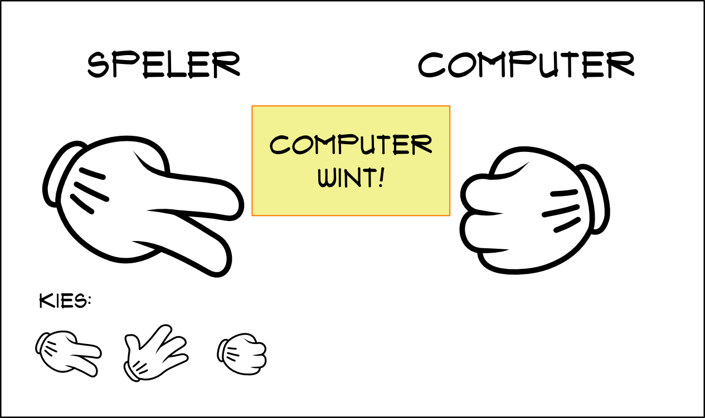
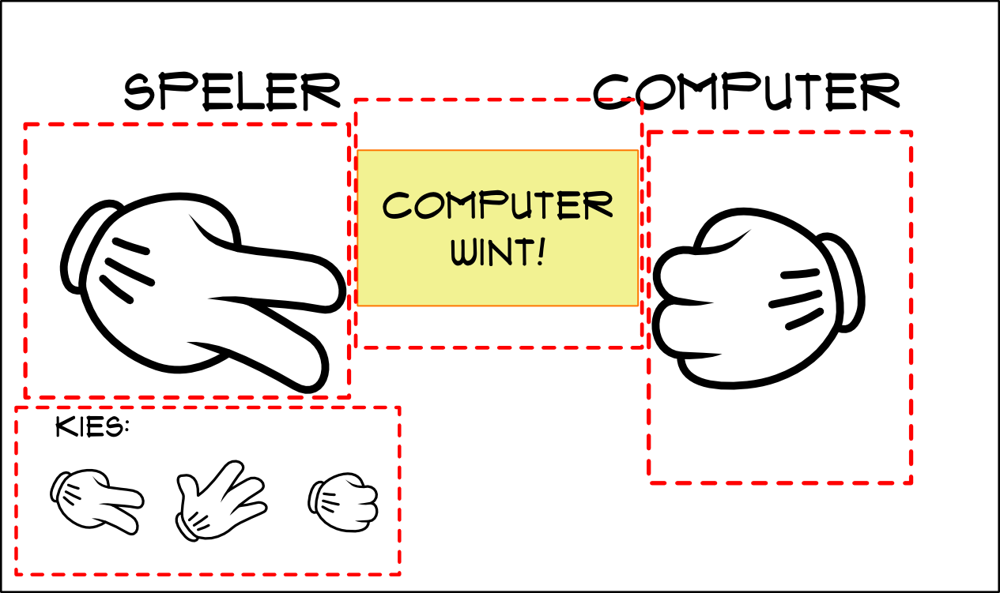
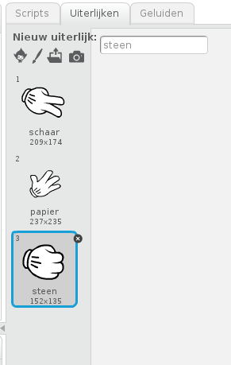
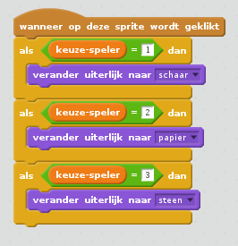
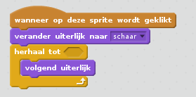
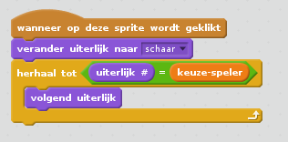
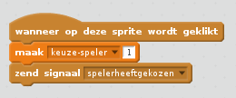
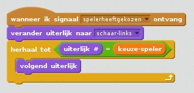

# Steen, papier, schaar

Misschien ken je het wel, je bent met je vrienden of vriendinnen en iemand moet iets vervelends doen of juist iets heel leuks. Je kunt dan een rijmpje gebruiken zoals iene-miene-mutte, maar daarbij kun je vantevoren al weten wie er 'af' is. Met steen, papier, schaar blijft dit altijd een verrassing.

Het spel steen, papier, schaar is al heel oud. Al in de 17e eeuw werd het in Japan gespeeld. Andere varianten bestonden al vele eeuwen eerder in China. Tegenwoordig is het zo populair dat er zelfs wereldkampioenschappen voor zijn!

# De regels van steen, papier, schaar

Je speelt het spel met z'n tweeen. Je telt hardop tot drie, en bij de "drie" houd je je hand op een bepaalde manier:

----- | ------------- |
steen | gesloten vuist |
papier | vlakke hand |
schaar | twee uitgestrekte vingers |

De schaar kan het papier doorknippen en schaar verslaat dus papier. Het papier kan om de steen gevouwen worden en papier verslaat dus steen. Met de steen kun je schaar bot maken en steen verslaat dus de schaar.

Als je allebei hetzelfde hebt gekozen, wint er niemand en moet je nog een keer spelen.

# Het spel bouwen

We gaan nu het spel steen, papier, schaar maken waarbij we tegen de computer gaan spelen. Voordat we kunnen beginnen moeten we goed nadenken hoe we willen dat het er uit gaat zien. Ik maak meestal eerst een tekeningetje:

Aan iedere kant staat een hand. Links staat de speler, rechts de computer. De speler kan nu een van de handgebaren kiezen door op de kleine handjes onderaan te kiezen. Als de speler dat doet, moet zijn grote hand veranderen in het gebaar dat hij heeft gekozen. Tegelijkertijd kiest de computer zelf een gebaar en verandert ook zijn grote hand. Als de computer wint, dan wil ik dat op het scherm komt te staan dat de computer heeft gewonnen, als ik win, wil ik dat daar komt te staan dat ik heb gewonnen en als we gelijk spelen, komt dat er te staan.

Dit lijkt best eenvoudig, maar het is te veel om allemaal tegelijk te doen. Wat programmeurs doen als ze een ingewikkeld probleem tegenkomen, is het probleem opsplitsen in kleinere problemen. Als die dan nog steeds ingewikkeld zijn, splitsen ze dat weer op in nog kleinere problemen, totdat de oplossing eenvoudig is. Zo maak je van een moeilijk probleem eigenlijk heel veel makkelijke problemen!

Hoe zouden we het probleem kunnen opsplitsen? Een van de vragen die we kunnen stellen, is welke stukken we los van elkaar zouden kunnen zien.

**Oefening:** Zie jij nu al aparte onderdelen? Welke?

Ik zie bijvoorbeeld de volgende onderdelen:

De grote hand kan ik maken los van de andere onderdelen. De andere grote hand is bijna hetzelfde. Dan is het stukje om te kiezen en ten slotte de boodschap als we winnen of verliezen.

Het kan zijn dat jij het heel anders ziet. Dat is helemaal niet erg, want misschien is jouw manier van kijken wel beter. Verschillende programmeurs kijken op verschillende manieren naar problemen en doordat ze verschillend van elkaar kijken, ontstaan er ook programma's die compleet verschillend zijn. De ene manier is niet per se beter of slechter dan de andere. En de computer vindt het ook niet erg, die voert gewoon uit wat je hebt verteld, zonder te klagen.

Goed, ik heb nu kleinere onderdelen gemaakt, die ik later wel met elkaar moet laten samenwerken. Ik weet alleen nog niet precies hoe ik dat moet gaan doen. Als programmeurs niet weten hoe ze iets moeten doen, gaan ze vaak wat uitproberen. Met een beetje geluk snappen ze daarna beter hoe het werkt en weten ze wel hoe het werkt. Dat gaan we hier ook doen. Misschien lukt het, misschien ook niet, maar dat houdt het spannend, nietwaar?

# De grote handen

De grote handen kunnen drie vormen aannemen: schaar, papier en steen. Het klinkt logisch dat we hier dan een sprite voor maken met drie uiterlijken. Zorg dat je de bestanden schaar.svg, papier.svg en steen.svg hebt opgeslagen en klik bij 'Nieuwe sprite:' op het mapje (dat zit tussen de kwast en het fototoestel). Kies nu het bestand `schaar.svg` en klik op OK. Klik daarna op de tab 'Uiterlijken' en kies `papier.svg`. Ten slotte doen we hetzelfde met `steen.svg`. Het resultaat moet er dan als volgt uitzien:

Nu we de uiterlijken hebben gemaakt, moeten we ervoor zorgen dat we het uiterlijk kunnen selecteren dat hoort bij de keuze van de speler.
Als we kijken welke onderdelen allemaal te maken hebben met de keuze van de speler, dan zien we dat de keuzeknoppen onderaan de keuze bepalen, de grote hand van de speler het uiterlijk moet hebben dat hoort bij de keuze en dat de boodschap aan het eind van het spel afhangt van de keuze van de speler (en die van de computer natuurlijk). Er zijn dus drie onderdelen die allemaal iets moeten doen met de keuze van de speler. Een logische stap is dan om de keuze van de speler op te slaan in een variabele die gedeeld wordt met alle sprites.

We gaan hiervoor een variabele `keuze-speler` maken. Selecteer bij 'Scripts' de oranje bouwblokken bij 'Data'. Klik vervolgens op 'Maak een variabele'. Geef deze de naam `keuze-speler` en zorg dat deze *voor alle sprites* beschikbaar is. Je ziet nu een bouwblok voor de variabele `keuze-speler`. Je kunt deze aanvinken, zodat de variabele ook zichtbaar wordt op het scherm.

Je kunt er ook op dubbelklikken, doe dit net zo lang totdat je een schuif ziet:

Met deze schuif kunnen we de variabele een bepaalde waarde geven. Dat is makkelijk als we willen testen of wat we doen werkt.

## Testen

Testen is ontzettend belangrijk als je programmeert. Als je programmeert kun je
fouten maken, zelfs als je supergoed oplet. Door vaak tussendoor te testen kun
je snel zien of je een fout hebt gemaakt en de fout meteen oplossen. Hoe langer het duurt voor je een fout ontdekt, hoe moeilijker het is om de fout op te lossen.

**Oefening:** waarom zou dit zo kunnen zijn?

## Het uiterlijk veranderen

We hebben besloten om de grote hand 3 uiterlijken te geven. Als we nu kijken naar het grotere geheel, dan betekent dat we een handgebaar moeten kiezen (dat gaat straks via de drie kleine knoppen) en dat vervolgens het uiterlijk van de hand zich aanpast aan de keuze. We hadden ook al bedacht dat de keuze in een variabele gezet moet worden.

We kunnen dit probleem opsplitsen in twee delen:

* als ik op een van de kleine knoppen klik, moet mijn keuze worden opgeslagen
* als mijn keuze gemaakt is, moet de grote hand veranderen naar het uiterlijk van de keuze.

We doen even alsof het eerste al bestaat en beginnen met het tweede deel. Het eerste stuk kunnen we namelijk nadoen door zelf de variabele te veranderen.

Voor het tweede stuk moeten we nog wel even afspreken wat de waarde van de variabele betekent, anders weten we niet wat we moeten doen. Hiervoor heb ik het
volgende gekozen:

waarde | uiterlijk
------ | -----------
1      | schaar
2      | papier
3      | steen

Ik had ook andere waardes kunnen kiezen, bijvoorbeeld 1=papier,2=steen,3=schaar. Ik heb de volgorde gekozen waarin ik de sprites heb neergezet. We zullen straks zien dat dat voor ons het leven makkelijker maakt. Om de rest van deze scratch-les goed te volgen is het handig om dezelfde codering en zelfde volgorde van uiterlijken te kiezen.

**Oefening:** pas de volgorde van de uiterlijken van de grote hand aan zodat deze hetzelfde is als in deze tekst.

Laten we beginnen met een korte test. Als we op de sprite klikken, moet de sprite het uiterlijk krijgen van de variabele `keuze-speler`. We moeten ons eerste programma dus beginnen met de gebeurtenis "wanneer op deze sprite wordt geklikt".
Dan klinkt het simpel: we kijken welke keuze in de variabele staat, is het de warde 1, dan selecteren we het uiterlijk schaar, bij 2 papier en bij 3 steen. Dat kunnen we doen met een paar als-dan blokjes:

Dat was niet moeilijk toch? Maar stel je eens voor dat je niet 3 handgebaren had, maar 100? Dan had het script niet meer op het scherm gepast! Zouden we het slimmer kunnen doen?

Helaas kunnen we in Scratch niet direct zeggen: "verander naar uiterlijk nummer 2". We hebben wel het blokje "volgend uiterlijk". Als we nu kunnen zorgen dat
we uiterlijk 1 hebben gekozen, dan kun je het volgende doen:

Voor uiterlijk 1: hiervoor hoeven we niets te doen. klaar.
Voor uiterlijk 2: volgend uiterlijk. klaar. 
Voor uiterlijk 3: twee keer volgend uiterlijk. klaar. 

Misschien herken je hier al een herhaling in. Stel dat we inderdaad honderd uiterlijken hadden, dan konden we verder gaan:

Voor uiterlijk 4: drie keer volgend uiterlijk. klaar. 
Voor uiterlijk 5: vier keer volgend uiterlijk. klaar. 
Voor uiterlijk 6: vijf keer volgend uiterlijk. klaar. 

enzovoorts.

We kunnen dit dus programmeren met een herhaling:

We moeten alleen weten wanneer we mogen stoppen met herhalen, anders zijn we oneindig lang bezig. We mogen stoppen als het uiterlijk klopt met de keuze. Herinner je dat we de waardes van de variabele moesten kiezen? Onze keuze was slim, want de waarde van de variabele is precies het nummer van het uiterlijk. We kunnen dus gewoon kijken of het nummer van het uiterlijk hetzelfde is als de waarde van de variabele `keuze-speler`:

Uiteraard moeten we even testen of het werkt. Dat doe je als volgt:

1. Zet met de schuif de waarde van `keuze-speler` op 1.
2. Klik op de grote hand.
3. Kijk of het uiterlijk gelijk is aan schaar.
4. Herhaal stap 1,2 en 3 voor keuzes 2 met papier en 3 met steen.

De stappen hierboven noemen we een testcase (engels voor testgeval). Er zijn mensen die het testen van programma's als beroep hebben. Die heten dan Test-kees (grapje natuurlijk). Deze testers bedenken dan testcases en voeren ze uit.

**Oefening:** voer de testcase uit en kijk of alles werkt.

**Oefening:** wat gebeurt er als je de waarde van `keuze-speler` op iets anders zet
dan 1,2 of 3? Hoe komt dat?

## Kiezen met de knoppen

Als alles goed is gegaan, kun je nu de variabele `keuze-speler` aanpassen en het uiterlijk laten veranderen. Nu willen we kunnen kiezen door middel van de knoppen.

De knoppen maken is niet moeilijk: kies upload sprite, kies de juiste afbeelding (schaar, papier, steen) en klik op ok. Als bij jou hetzelfde gebeurt als bij mij, dan is de sprite veel te groot. Onder de tab 'Uiterlijken' kun je de afbeelding kleiner maken.

**Oefening:** Maak de drie knoppen en zorg dat de afbeeldingen niet te groot zijn.

Nu moeten we voor iedere knop een script maken.

Eigenlijk moet dit script hetzelfde doen wat we eerder met de schuif deden, namelijk de variabele `keuze-speler` op de juiste waarde zetten. Bij de schaar hoorde de waarde 1, dus krijgen we het volgende script:

Uiteraard gaan we weer testen.

**Oefening:** als we nu op de knop van schaar drukken, wat gebeurt er dan met:
1. de grote hand
2. de variabele `keuze-speler`?

De variabele staat wel op de juiste waarde, maar het uiterlijk wordt nog niet aangepast. Dat komt omdat het script voor het aanpassen van het uiterlijk alleen reageert als we op de sprite klikken. Om er voor te zorgen dat het reageert op onze aanpassingen, moeten we hiervoor zelf een gebeurtenis maken. We laten deze gebeurtenis dan gebeuren als we op de keuzeknop hebben gedrukt, zodat het script voor het veranderen van het uiterlijk kan reageren op deze gebeurtenis. Zo'n eigen gebeurtenis noemen we in Scratch een *signaal*.

We voegen een blokje toe aan het eind van het script: zend signaal. kies bij het signaal de optie "nieuw bericht" en kies als berichtnaam `spelerheeftgekozen`. Het script is dan:

Het script van de grote hand moet hier op reageren:

**Oefening:** maak de scripts voor alle knoppen en pas het script van de grote hand aan.

Je raadt het al, we hebben iets veranderd, dus moeten we testen!

**Oefening:** test of de knoppen werken. Wat moet je allemaal controleren in deze test?

## De computer laten kiezen

Als je alles juist hebt geprogrammeerd, kun je nu op een knop drukken en verandert de grote hand automatisch van uiterlijk. In het spel moeten allebei de spelers op hetzelfde moment kiezen. Als we dat in Scratch willen proberen, wordt het ineens erg ingewikkeld, dat moet je maar van me geloven. Gelukkig kan de computer ook kiezen nadat de speler heeft gekozen. Zolang de computer niet stiekem kijkt wat de spelers keuze was, is het nog steeds eerlijk.

We moeten de computer dus laten kiezen nadat we zelf hebben gekozen. We kunnen nu mooi gebruik maken van de gebeurtenis die we hebben gemaakt met het signaal `spelerheeftgekozen`.

Het script om de computer te laten kiezen moeten we wel maken bij een bepaalde sprite. Ik heb ervoor gekozen om dit te doen bij de grote hand voor de computer. Deze sprite kunnen we het makkelijkst maken door de andere hand te kopieren.

**Oefening:** kopieer de sprites van de hand van de speler (rechts klikken en dan 'kopie maken') en zorg dat alle uiterlijken gespiegeld zijn (hiervoor is een knop 'links-rechts omdraaien')

Haal de scripts van de nieuwe sprite weg en maak een nieuw script. Begin met het blokje `wanneer ik signaal ... ontvang`. Selecteer in het blokje het signaal `spelerheeftgekozen`. Als het goed is wordt dit script geactiveerd als de speler op een van de knoppen heeft gedrukt. Laten we dat even testen. Voeg het blokje `zeg Hello! 2 sec.` toe. Als we nu op een van de knoppen drukken, zouden we de tekst "Hello!" moeten zien.

TODO: image

**Oefening:** Test of dit werkt.

Nu moeten we de computer laten kiezen. Net als bij de speler moeten we de keuze van de computer ergens onthouden. Bij de speler hadden we hiervoor een variabele gemaakt. Dit gaan we ook doen voor de keuze van de computer.

**Oefening:** Maak een variabele voor de keuze van de computer en noem deze `keuze-computer`. Doe dit net zoals bij de variabele `keuze-speler`. Als het goed is hebben we dan ook een slider voor de keuze van de computer.

TODO: image

Nu willen we ook hier het uiterlijk van het script aanpassen, volgens de waarde van de variabele `keuze-computer`. Dit hebben we al eens gedaan voor de keuze van de speler, dus we kunnen lekker makkelijk een stuk van dit script kopiëren.

**Oefening:** Kopieer van de speler sprite het stuk script om het uiterlijk te veranderen. Wat moet je in dit script nog aanpassen?

Goede programmeurs vinden het meestal niet verstandig om grote stukken programma te kopiëren. Als er namelijk iets moet worden aangepast moet je die aanpassingen ook doen in alle stukken waar je het hebt gekopiëerd! Dat is best veel werk en vervelend. In programmeertalen zijn er daarom manieren om een stuk programma meerdere keren te gebruiken, zonder dat je het hoeft te kopiëren. Dat houdt je programma overzichtelijk. Je kunt een goede programmeur herkennen aan korte programma's, maar die nog wel begrijpbaar zijn!

Als je nu de slider van `keuze-computer` verandert, moet het script het juiste uiterlijk kiezen.

**Oefening:** Test of dit zo is met de volgende waardes voor `keuze-computer`: 1,2,3.

**Oefening:** Wat gebeurt er als `keuze-computer` een andere waarde heeft, zoals 0 of 4?

TODO: zet de keuze in het script

# De scheidsrechter

Als de speler en de computer allebei hebben gekozen, kunnen we gaan kijken wie heeft gewonnen. Hiervoor maken we een sprite die we voor het gemak de scheidsrechter noemen.

**Oefening:** maak een nieuwe sprite, bijvoorbeeld uit de bibliotheek.

Ik heb als voorbeeld de kat gekozen uit de bibliotheek. Dit is niet helemaal volgens het ontwerp, maar soms gebeurt het dat je terwijl je bezig bent ontdekt dat iets makkelijker of leuker kan!

Ik wil de kat laten zeggen wie er wint. Als de speler wint zegt de kat "speler wint", als de computer wint zegt de kat "computer wint" en bij gelijk spel zegt de kat "gelijk spel". We moeten het script van de kat starten wanneer zowel de speler als de computer hebben gekozen. Omdat de speler en de computer allebei een signaal sturen als ze hebben gekozen, kunnen we het script starten met het blokje "wanneer ik signaal ... ontvang".

**Oefening:** op welk signaal moet het script reageren?

# uitbreiding: hagedis en spock?

# uitbreiding: altijd winnen

Pas het programma aan zodat de computer altijd wint. Hoe kun je de computer laten valsspelen?

# Informatie over de afbeeldingen

